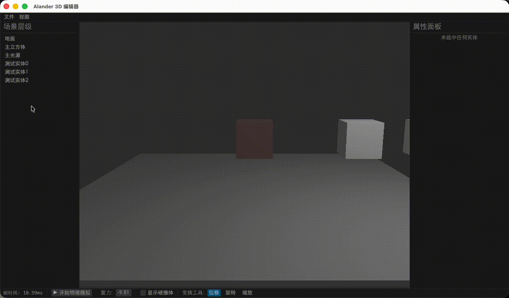

# Alander

[中文](./README-zh.md)

Alander is a modern 3D creation suite (DCC, Digital Content Creation) developed based on Rust, aiming to become a strong competitor to Blender.


## Project Vision

Alander is not merely a 3D software, but rather a "future-oriented procedural 3D engine" with the following core differentiating features: 

- **Cloud-native and Collaboration**: Supports real-time collaboration among multiple users, similar to Figma or Google Docs
- **Non-destructive Workflow**: Fully adopts node-based and stack-based logic, and all operations can be adjusted at any time
- **ECS Architecture**: High-performance parallel computing, capable of easily handling millions of objects

## Supporting Platform
* macos


## Example

```bash
cargo run --bin alander
```

## 许可证

本项目采用Apache 2.0许可证（见LICENSE文件）。

## 致谢
- Rust生态系统，特别是[wgpu]和[egui]项目
- Bevy引擎的ECS系统设计灵感
- Blender社区的3D软件开发经验

---

*Alander - The Rust-based, Collaborative 3D Engine for the Web Era.*